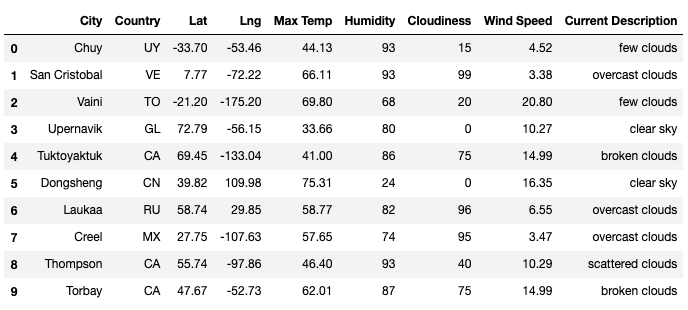
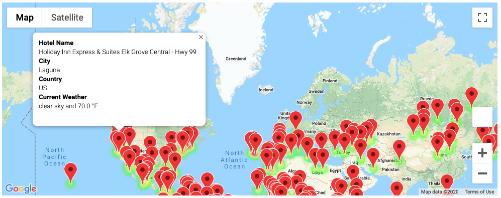
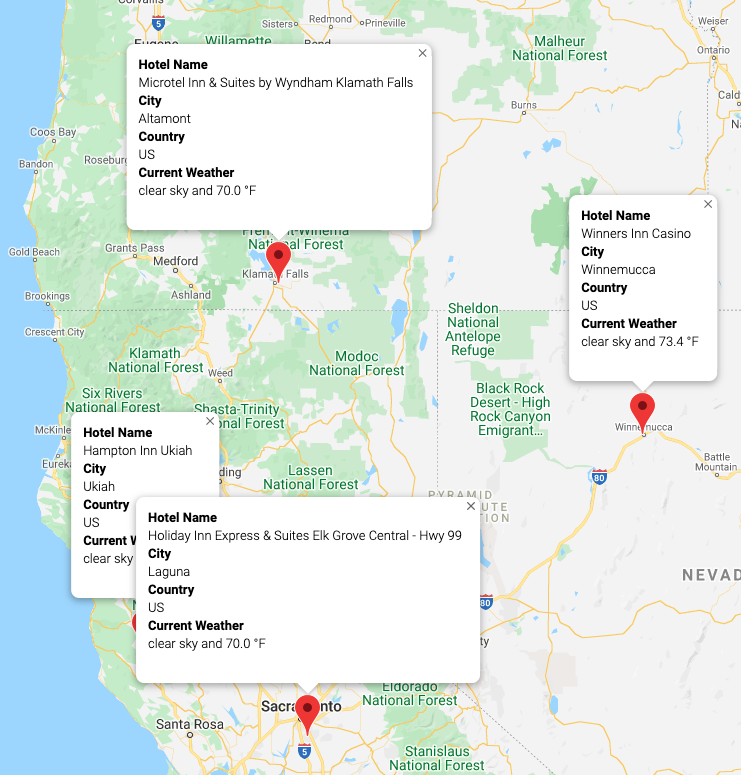

# PlanMyTripApp Challenge

## Overview
The objective of this project is to develop an application in Python that will filter weather data based on input criteria from users which can be used to identify potential travel destinations and nearby hotels. Finaly, users can select four cities from a list of desired travel destinations and create a travel itinerary. The project can be divided into three main tasks.

## Project Breakdown
### Task 1
Our first task is to create a set of random latitude and longitude combination. Secondly we generate a list of unique cities from the set of lat and long. Finally we collect city weather data using OpenWeatherMap API's and create a DataFrame as shown below:

### Task 2
In task 2 we retrieve nearby hotels for the cities exported in the CSV from task1. We then retrieve nearby hotels using Google Maps API's. Finally we create a Google map and add marker layer for the user to choose the cities based on the city weather data shown in the city balloon as shown below:

### Task3
In task3, after user has selected four cities of interest, he/she can create a vacation itinerary. We create a direction layer map using the start and end latitude-longitude pairs and stop1, stop2, stop3 as waypoints as shown below in the map:

